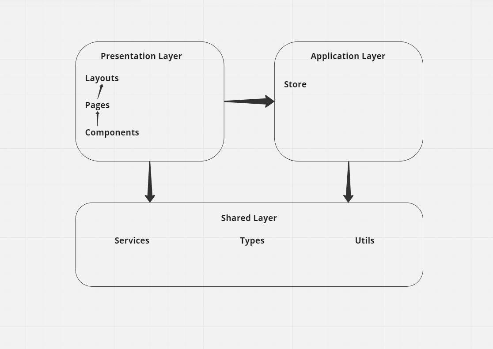

# genesis_learning_app

## Build Setup

```bash
# install dependencies
$ npm install

# serve with hot reload at localhost:3000
$ npm run dev

# build for production and launch server
$ npm run build
$ npm run start

# generate static project
$ npm run generate
```

For detailed explanation on how things work, check out the [documentation](https://nuxtjs.org).

## Description of the workflow

 1. The development of the application `genesis_learning_app` began to familiarize myself with the task, after reading it, and seeing the priorities, began to create a repository.
 2. Deployed the application template on Nuxt, use `npx nuxi init <project-name>`.
3. I added libraries necessary for the work, such as `vuetyfy` and `nuxt/axios`.
4. The next step is to describe `Vuex` methods for working with the API and getting the necessary information.
5. I encountered a problem with `CORS` security policies, I had to solve this problem with the help of `proxy` pads.
6. Then I began to create the visual and logical components of the `CoursesList` component.
7. Then I began to create the visual and logical components of the `Course` component.
8. Having trouble playing streaming video). Для решения єтой проблемы использовал библиотеку `Hls.js`
9. Then it was decided to put `<video>` into a separate component `VideoPlayer`, and to put the logic for playing and committing the process to `localStorage`, into it.
10. Next I added the video playback functionality on `hover`.

## feature/architecture



Розробка відбувалась на фреймворку Nuxt, який слідує принципу "Convention over Configuration".
Архітектурний принцип "Визначення вигляду на основі маршрутів" означає, що в Nuxt.js структура файлів і папок у проекті відповідає певним маршрутам і автоматично визначає, які компоненти мають бути завантажені для кожного маршруту.

1. ### Presentation Layer:

`Layouts:` Розташовані в папці layouts. Вони визначають загальну структуру та макети для різних сторінок вашого додатку.


`Pages:` Знаходяться в папці pages. Кожен файл в цій папці відповідає окремій сторінці додатку. Вони використовують компоненти та сервіси для відображення контенту та взаємодії з користувачем.


`Components:` Знаходяться в папці components. Вони складаються з невеликих реюзабельних компонентів, які можуть бути використані на різних сторінках або в різних макетах. Ці компоненти відповідають за відображення конкретних елементів інтерфейсу.

2. ### Shared Layer:

`Services:` Розташовані в папці shared/services. Вони містять функції та функціональність, яка може бути використана в різних частинах додатку. Наприклад, це можуть бути сервіси для роботи з сервером або сторонніми API.


`Types:` Розташовані в папці shared/types. Тут ви можете визначити типи даних, інтерфейси та перечислення, які використовуються в різних частинах проекту.


`Utils:` Розташовані в папці shared/utils. Ці утиліти містять корисні функції, які можуть бути використані в різних частинах проекту, такі як датові операції, форматування тексту або робота з URL-адресами.

3. ### Application Layer:

`Store:` Розташований в папці store. Це централізований зберігач стану додатку, який базується на Vuex. В папці store розташовуємо модулі Vuex для зберігання, оновлення та взаємодії зі станом додатку. Використоветься store для управління бізнес-логікою та спільного використання даних між різними компонентами.
